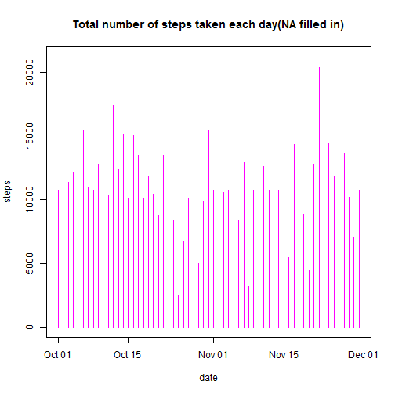

Reproducible Research Peer Assignment 1
=======================================

Loading and preprocessing the data
----------------------------------

Read in the file, then convert the date field into date format.


```r
data <- read.csv("activity.csv", stringsAsFactors = FALSE)
data$date <- as.Date(data$date, format = "%Y-%m-%d")
str(data)
```

```
## 'data.frame':	17568 obs. of  3 variables:
##  $ steps   : int  NA NA NA NA NA NA NA NA NA NA ...
##  $ date    : Date, format: "2012-10-01" "2012-10-01" ...
##  $ interval: int  0 5 10 15 20 25 30 35 40 45 ...
```

What is mean total number of steps taken per day?
-------------------------------------------------

Calculate the total number of steps for each day, then plot the graph.


```r
total.steps.daily <- aggregate(steps ~ date, data = data, sum, na.rm = TRUE)
plot(total.steps.daily, type = "h", main = "Total number of steps taken each day", col = "magenta")
```

 

Now to calculate the mean and median total number of steps taken per day.  
Note: For days where all the data is NA, it will return NA for both mean and median.


```r
tapply(data$steps, data$date, summary)
```

```
## $`2012-10-01`
##    Min. 1st Qu.  Median    Mean 3rd Qu.    Max.    NA's 
##      NA      NA      NA     NaN      NA      NA     288 
## 
## $`2012-10-02`
##    Min. 1st Qu.  Median    Mean 3rd Qu.    Max. 
##    0.00    0.00    0.00    0.44    0.00  117.00 
## 
## $`2012-10-03`
##    Min. 1st Qu.  Median    Mean 3rd Qu.    Max. 
##     0.0     0.0     0.0    39.4    15.0   613.0 
## 
## $`2012-10-04`
##    Min. 1st Qu.  Median    Mean 3rd Qu.    Max. 
##     0.0     0.0     0.0    42.1    30.2   547.0 
## 
## $`2012-10-05`
##    Min. 1st Qu.  Median    Mean 3rd Qu.    Max. 
##     0.0     0.0     0.0    46.2    15.2   555.0 
## 
## $`2012-10-06`
##    Min. 1st Qu.  Median    Mean 3rd Qu.    Max. 
##     0.0     0.0     0.0    53.5    35.2   526.0 
## 
## $`2012-10-07`
##    Min. 1st Qu.  Median    Mean 3rd Qu.    Max. 
##     0.0     0.0     0.0    38.2    34.0   523.0 
## 
## $`2012-10-08`
##    Min. 1st Qu.  Median    Mean 3rd Qu.    Max.    NA's 
##      NA      NA      NA     NaN      NA      NA     288 
## 
## $`2012-10-09`
##    Min. 1st Qu.  Median    Mean 3rd Qu.    Max. 
##     0.0     0.0     0.0    44.5    20.0   748.0 
## 
## $`2012-10-10`
##    Min. 1st Qu.  Median    Mean 3rd Qu.    Max. 
##     0.0     0.0     0.0    34.4    32.2   413.0 
## 
## $`2012-10-11`
##    Min. 1st Qu.  Median    Mean 3rd Qu.    Max. 
##     0.0     0.0     0.0    35.8     7.2   748.0 
## 
## $`2012-10-12`
##    Min. 1st Qu.  Median    Mean 3rd Qu.    Max. 
##     0.0     0.0     0.0    60.4    32.0   802.0 
## 
## $`2012-10-13`
##    Min. 1st Qu.  Median    Mean 3rd Qu.    Max. 
##     0.0     0.0     0.0    43.1    24.2   542.0 
## 
## $`2012-10-14`
##    Min. 1st Qu.  Median    Mean 3rd Qu.    Max. 
##     0.0     0.0     0.0    52.4    22.2   540.0 
## 
## $`2012-10-15`
##    Min. 1st Qu.  Median    Mean 3rd Qu.    Max. 
##     0.0     0.0     0.0    35.2     7.0   786.0 
## 
## $`2012-10-16`
##    Min. 1st Qu.  Median    Mean 3rd Qu.    Max. 
##     0.0     0.0     0.0    52.4    26.0   758.0 
## 
## $`2012-10-17`
##    Min. 1st Qu.  Median    Mean 3rd Qu.    Max. 
##     0.0     0.0     0.0    46.7    11.2   744.0 
## 
## $`2012-10-18`
##    Min. 1st Qu.  Median    Mean 3rd Qu.    Max. 
##     0.0     0.0     0.0    34.9     0.0   759.0 
## 
## $`2012-10-19`
##    Min. 1st Qu.  Median    Mean 3rd Qu.    Max. 
##     0.0     0.0     0.0    41.1    20.2   512.0 
## 
## $`2012-10-20`
##    Min. 1st Qu.  Median    Mean 3rd Qu.    Max. 
##     0.0     0.0     0.0    36.1    13.0   532.0 
## 
## $`2012-10-21`
##    Min. 1st Qu.  Median    Mean 3rd Qu.    Max. 
##     0.0     0.0     0.0    30.6    17.2   501.0 
## 
## $`2012-10-22`
##    Min. 1st Qu.  Median    Mean 3rd Qu.    Max. 
##     0.0     0.0     0.0    46.7    18.2   783.0 
## 
## $`2012-10-23`
##    Min. 1st Qu.  Median    Mean 3rd Qu.    Max. 
##     0.0     0.0     0.0    31.0    12.2   499.0 
## 
## $`2012-10-24`
##    Min. 1st Qu.  Median    Mean 3rd Qu.    Max. 
##     0.0     0.0     0.0    29.0    14.2   533.0 
## 
## $`2012-10-25`
##    Min. 1st Qu.  Median    Mean 3rd Qu.    Max. 
##     0.0     0.0     0.0     8.7     0.0   443.0 
## 
## $`2012-10-26`
##    Min. 1st Qu.  Median    Mean 3rd Qu.    Max. 
##     0.0     0.0     0.0    23.5    15.0   440.0 
## 
## $`2012-10-27`
##    Min. 1st Qu.  Median    Mean 3rd Qu.    Max. 
##     0.0     0.0     0.0    35.1     6.0   555.0 
## 
## $`2012-10-28`
##    Min. 1st Qu.  Median    Mean 3rd Qu.    Max. 
##     0.0     0.0     0.0    39.8    38.2   533.0 
## 
## $`2012-10-29`
##    Min. 1st Qu.  Median    Mean 3rd Qu.    Max. 
##     0.0     0.0     0.0    17.4     0.0   591.0 
## 
## $`2012-10-30`
##    Min. 1st Qu.  Median    Mean 3rd Qu.    Max. 
##     0.0     0.0     0.0    34.1    22.0   523.0 
## 
## $`2012-10-31`
##    Min. 1st Qu.  Median    Mean 3rd Qu.    Max. 
##     0.0     0.0     0.0    53.5    22.2   757.0 
## 
## $`2012-11-01`
##    Min. 1st Qu.  Median    Mean 3rd Qu.    Max.    NA's 
##      NA      NA      NA     NaN      NA      NA     288 
## 
## $`2012-11-02`
##    Min. 1st Qu.  Median    Mean 3rd Qu.    Max. 
##     0.0     0.0     0.0    36.8     8.2   753.0 
## 
## $`2012-11-03`
##    Min. 1st Qu.  Median    Mean 3rd Qu.    Max. 
##     0.0     0.0     0.0    36.7    25.5   533.0 
## 
## $`2012-11-04`
##    Min. 1st Qu.  Median    Mean 3rd Qu.    Max.    NA's 
##      NA      NA      NA     NaN      NA      NA     288 
## 
## $`2012-11-05`
##    Min. 1st Qu.  Median    Mean 3rd Qu.    Max. 
##     0.0     0.0     0.0    36.2     7.0   785.0 
## 
## $`2012-11-06`
##    Min. 1st Qu.  Median    Mean 3rd Qu.    Max. 
##     0.0     0.0     0.0    28.9    11.2   630.0 
## 
## $`2012-11-07`
##    Min. 1st Qu.  Median    Mean 3rd Qu.    Max. 
##     0.0     0.0     0.0    44.7    20.5   766.0 
## 
## $`2012-11-08`
##    Min. 1st Qu.  Median    Mean 3rd Qu.    Max. 
##     0.0     0.0     0.0    11.2     0.0   359.0 
## 
## $`2012-11-09`
##    Min. 1st Qu.  Median    Mean 3rd Qu.    Max.    NA's 
##      NA      NA      NA     NaN      NA      NA     288 
## 
## $`2012-11-10`
##    Min. 1st Qu.  Median    Mean 3rd Qu.    Max.    NA's 
##      NA      NA      NA     NaN      NA      NA     288 
## 
## $`2012-11-11`
##    Min. 1st Qu.  Median    Mean 3rd Qu.    Max. 
##     0.0     0.0     0.0    43.8    26.0   540.0 
## 
## $`2012-11-12`
##    Min. 1st Qu.  Median    Mean 3rd Qu.    Max. 
##     0.0     0.0     0.0    37.4     0.0   542.0 
## 
## $`2012-11-13`
##    Min. 1st Qu.  Median    Mean 3rd Qu.    Max. 
##     0.0     0.0     0.0    25.5    13.5   444.0 
## 
## $`2012-11-14`
##    Min. 1st Qu.  Median    Mean 3rd Qu.    Max.    NA's 
##      NA      NA      NA     NaN      NA      NA     288 
## 
## $`2012-11-15`
##    Min. 1st Qu.  Median    Mean 3rd Qu.    Max. 
##    0.00    0.00    0.00    0.14    0.00   33.00 
## 
## $`2012-11-16`
##    Min. 1st Qu.  Median    Mean 3rd Qu.    Max. 
##     0.0     0.0     0.0    18.9     0.0   475.0 
## 
## $`2012-11-17`
##    Min. 1st Qu.  Median    Mean 3rd Qu.    Max. 
##     0.0     0.0     0.0    49.8    10.2   753.0 
## 
## $`2012-11-18`
##    Min. 1st Qu.  Median    Mean 3rd Qu.    Max. 
##     0.0     0.0     0.0    52.5    29.2   785.0 
## 
## $`2012-11-19`
##    Min. 1st Qu.  Median    Mean 3rd Qu.    Max. 
##     0.0     0.0     0.0    30.7     6.0   789.0 
## 
## $`2012-11-20`
##    Min. 1st Qu.  Median    Mean 3rd Qu.    Max. 
##     0.0     0.0     0.0    15.5     0.0   500.0 
## 
## $`2012-11-21`
##    Min. 1st Qu.  Median    Mean 3rd Qu.    Max. 
##     0.0     0.0     0.0    44.4     0.0   758.0 
## 
## $`2012-11-22`
##    Min. 1st Qu.  Median    Mean 3rd Qu.    Max. 
##     0.0     0.0     0.0    70.9    42.2   567.0 
## 
## $`2012-11-23`
##    Min. 1st Qu.  Median    Mean 3rd Qu.    Max. 
##     0.0     0.0     0.0    73.6    21.2   760.0 
## 
## $`2012-11-24`
##    Min. 1st Qu.  Median    Mean 3rd Qu.    Max. 
##     0.0     0.0     0.0    50.3    16.2   785.0 
## 
## $`2012-11-25`
##    Min. 1st Qu.  Median    Mean 3rd Qu.    Max. 
##     0.0     0.0     0.0    41.1    20.5   551.0 
## 
## $`2012-11-26`
##    Min. 1st Qu.  Median    Mean 3rd Qu.    Max. 
##     0.0     0.0     0.0    38.8    18.2   709.0 
## 
## $`2012-11-27`
##    Min. 1st Qu.  Median    Mean 3rd Qu.    Max. 
##     0.0     0.0     0.0    47.4    17.5   806.0 
## 
## $`2012-11-28`
##    Min. 1st Qu.  Median    Mean 3rd Qu.    Max. 
##     0.0     0.0     0.0    35.4     0.0   733.0 
## 
## $`2012-11-29`
##    Min. 1st Qu.  Median    Mean 3rd Qu.    Max. 
##     0.0     0.0     0.0    24.5     0.0   568.0 
## 
## $`2012-11-30`
##    Min. 1st Qu.  Median    Mean 3rd Qu.    Max.    NA's 
##      NA      NA      NA     NaN      NA      NA     288
```

What is the average daily activity pattern?
-------------------------------------------

Calculate the average number of steps by time interval, then plot the graph.


```r
avg.steps.int <- tapply(data$steps, data$interval, mean, na.rm = TRUE)
plot(avg.steps.int, type = "l", main = "Average number of steps by time interval", col = "magenta")
```

 

Finding the 5-minute interval, on average across all the days in the dataset, that contains the maximum number of steps.


```r
avg.steps.int[which.max(avg.steps.int)]
```

```
##   835 
## 206.2
```

Inputing missing values
-----------------------

Find the observations with no NA, inverse it logically, then add up the number of logical '1's (TRUE). This will be the number of cases that has NA values.


```r
sum(!complete.cases(data))
```

```
## [1] 2304
```

To fill the NA values, since the NA values are for entire days, filling it with the mean for that day impossible. Thus to fill it in with mean values for that time interval.

Creating a new dataset with the NA values filled in.


```r
nona.data <- data
for(i in 1:nrow(data)) {
        if(is.na(data[i,1])) {
                nona.data[i, 1] <- avg.steps.int[[as.character(data[i, 3])]]
        }
}
```

With the NA values filled in, calculate the total number of steps for each day, then plot the graph.


```r
nona.total.steps.daily <- aggregate(steps ~ date, data = nona.data, sum, na.rm = TRUE)
plot(nona.total.steps.daily, type = "h", main = "Total number of steps taken each day(NA filled in)", col = "magenta")
```

 

With the NA values filled in, calculate the mean and median total number of steps taken per day.  
Note: For days where all the data is NA, it will return NA for both mean and median.


```r
tapply(nona.data$steps, nona.data$date, summary)
```

```
## $`2012-10-01`
##    Min. 1st Qu.  Median    Mean 3rd Qu.    Max. 
##    0.00    2.49   34.10   37.40   52.80  206.00 
## 
## $`2012-10-02`
##    Min. 1st Qu.  Median    Mean 3rd Qu.    Max. 
##    0.00    0.00    0.00    0.44    0.00  117.00 
## 
## $`2012-10-03`
##    Min. 1st Qu.  Median    Mean 3rd Qu.    Max. 
##     0.0     0.0     0.0    39.4    15.0   613.0 
## 
## $`2012-10-04`
##    Min. 1st Qu.  Median    Mean 3rd Qu.    Max. 
##     0.0     0.0     0.0    42.1    30.2   547.0 
## 
## $`2012-10-05`
##    Min. 1st Qu.  Median    Mean 3rd Qu.    Max. 
##     0.0     0.0     0.0    46.2    15.2   555.0 
## 
## $`2012-10-06`
##    Min. 1st Qu.  Median    Mean 3rd Qu.    Max. 
##     0.0     0.0     0.0    53.5    35.2   526.0 
## 
## $`2012-10-07`
##    Min. 1st Qu.  Median    Mean 3rd Qu.    Max. 
##     0.0     0.0     0.0    38.2    34.0   523.0 
## 
## $`2012-10-08`
##    Min. 1st Qu.  Median    Mean 3rd Qu.    Max. 
##    0.00    2.49   34.10   37.40   52.80  206.00 
## 
## $`2012-10-09`
##    Min. 1st Qu.  Median    Mean 3rd Qu.    Max. 
##     0.0     0.0     0.0    44.5    20.0   748.0 
## 
## $`2012-10-10`
##    Min. 1st Qu.  Median    Mean 3rd Qu.    Max. 
##     0.0     0.0     0.0    34.4    32.2   413.0 
## 
## $`2012-10-11`
##    Min. 1st Qu.  Median    Mean 3rd Qu.    Max. 
##     0.0     0.0     0.0    35.8     7.2   748.0 
## 
## $`2012-10-12`
##    Min. 1st Qu.  Median    Mean 3rd Qu.    Max. 
##     0.0     0.0     0.0    60.4    32.0   802.0 
## 
## $`2012-10-13`
##    Min. 1st Qu.  Median    Mean 3rd Qu.    Max. 
##     0.0     0.0     0.0    43.1    24.2   542.0 
## 
## $`2012-10-14`
##    Min. 1st Qu.  Median    Mean 3rd Qu.    Max. 
##     0.0     0.0     0.0    52.4    22.2   540.0 
## 
## $`2012-10-15`
##    Min. 1st Qu.  Median    Mean 3rd Qu.    Max. 
##     0.0     0.0     0.0    35.2     7.0   786.0 
## 
## $`2012-10-16`
##    Min. 1st Qu.  Median    Mean 3rd Qu.    Max. 
##     0.0     0.0     0.0    52.4    26.0   758.0 
## 
## $`2012-10-17`
##    Min. 1st Qu.  Median    Mean 3rd Qu.    Max. 
##     0.0     0.0     0.0    46.7    11.2   744.0 
## 
## $`2012-10-18`
##    Min. 1st Qu.  Median    Mean 3rd Qu.    Max. 
##     0.0     0.0     0.0    34.9     0.0   759.0 
## 
## $`2012-10-19`
##    Min. 1st Qu.  Median    Mean 3rd Qu.    Max. 
##     0.0     0.0     0.0    41.1    20.2   512.0 
## 
## $`2012-10-20`
##    Min. 1st Qu.  Median    Mean 3rd Qu.    Max. 
##     0.0     0.0     0.0    36.1    13.0   532.0 
## 
## $`2012-10-21`
##    Min. 1st Qu.  Median    Mean 3rd Qu.    Max. 
##     0.0     0.0     0.0    30.6    17.2   501.0 
## 
## $`2012-10-22`
##    Min. 1st Qu.  Median    Mean 3rd Qu.    Max. 
##     0.0     0.0     0.0    46.7    18.2   783.0 
## 
## $`2012-10-23`
##    Min. 1st Qu.  Median    Mean 3rd Qu.    Max. 
##     0.0     0.0     0.0    31.0    12.2   499.0 
## 
## $`2012-10-24`
##    Min. 1st Qu.  Median    Mean 3rd Qu.    Max. 
##     0.0     0.0     0.0    29.0    14.2   533.0 
## 
## $`2012-10-25`
##    Min. 1st Qu.  Median    Mean 3rd Qu.    Max. 
##     0.0     0.0     0.0     8.7     0.0   443.0 
## 
## $`2012-10-26`
##    Min. 1st Qu.  Median    Mean 3rd Qu.    Max. 
##     0.0     0.0     0.0    23.5    15.0   440.0 
## 
## $`2012-10-27`
##    Min. 1st Qu.  Median    Mean 3rd Qu.    Max. 
##     0.0     0.0     0.0    35.1     6.0   555.0 
## 
## $`2012-10-28`
##    Min. 1st Qu.  Median    Mean 3rd Qu.    Max. 
##     0.0     0.0     0.0    39.8    38.2   533.0 
## 
## $`2012-10-29`
##    Min. 1st Qu.  Median    Mean 3rd Qu.    Max. 
##     0.0     0.0     0.0    17.4     0.0   591.0 
## 
## $`2012-10-30`
##    Min. 1st Qu.  Median    Mean 3rd Qu.    Max. 
##     0.0     0.0     0.0    34.1    22.0   523.0 
## 
## $`2012-10-31`
##    Min. 1st Qu.  Median    Mean 3rd Qu.    Max. 
##     0.0     0.0     0.0    53.5    22.2   757.0 
## 
## $`2012-11-01`
##    Min. 1st Qu.  Median    Mean 3rd Qu.    Max. 
##    0.00    2.49   34.10   37.40   52.80  206.00 
## 
## $`2012-11-02`
##    Min. 1st Qu.  Median    Mean 3rd Qu.    Max. 
##     0.0     0.0     0.0    36.8     8.2   753.0 
## 
## $`2012-11-03`
##    Min. 1st Qu.  Median    Mean 3rd Qu.    Max. 
##     0.0     0.0     0.0    36.7    25.5   533.0 
## 
## $`2012-11-04`
##    Min. 1st Qu.  Median    Mean 3rd Qu.    Max. 
##    0.00    2.49   34.10   37.40   52.80  206.00 
## 
## $`2012-11-05`
##    Min. 1st Qu.  Median    Mean 3rd Qu.    Max. 
##     0.0     0.0     0.0    36.2     7.0   785.0 
## 
## $`2012-11-06`
##    Min. 1st Qu.  Median    Mean 3rd Qu.    Max. 
##     0.0     0.0     0.0    28.9    11.2   630.0 
## 
## $`2012-11-07`
##    Min. 1st Qu.  Median    Mean 3rd Qu.    Max. 
##     0.0     0.0     0.0    44.7    20.5   766.0 
## 
## $`2012-11-08`
##    Min. 1st Qu.  Median    Mean 3rd Qu.    Max. 
##     0.0     0.0     0.0    11.2     0.0   359.0 
## 
## $`2012-11-09`
##    Min. 1st Qu.  Median    Mean 3rd Qu.    Max. 
##    0.00    2.49   34.10   37.40   52.80  206.00 
## 
## $`2012-11-10`
##    Min. 1st Qu.  Median    Mean 3rd Qu.    Max. 
##    0.00    2.49   34.10   37.40   52.80  206.00 
## 
## $`2012-11-11`
##    Min. 1st Qu.  Median    Mean 3rd Qu.    Max. 
##     0.0     0.0     0.0    43.8    26.0   540.0 
## 
## $`2012-11-12`
##    Min. 1st Qu.  Median    Mean 3rd Qu.    Max. 
##     0.0     0.0     0.0    37.4     0.0   542.0 
## 
## $`2012-11-13`
##    Min. 1st Qu.  Median    Mean 3rd Qu.    Max. 
##     0.0     0.0     0.0    25.5    13.5   444.0 
## 
## $`2012-11-14`
##    Min. 1st Qu.  Median    Mean 3rd Qu.    Max. 
##    0.00    2.49   34.10   37.40   52.80  206.00 
## 
## $`2012-11-15`
##    Min. 1st Qu.  Median    Mean 3rd Qu.    Max. 
##    0.00    0.00    0.00    0.14    0.00   33.00 
## 
## $`2012-11-16`
##    Min. 1st Qu.  Median    Mean 3rd Qu.    Max. 
##     0.0     0.0     0.0    18.9     0.0   475.0 
## 
## $`2012-11-17`
##    Min. 1st Qu.  Median    Mean 3rd Qu.    Max. 
##     0.0     0.0     0.0    49.8    10.2   753.0 
## 
## $`2012-11-18`
##    Min. 1st Qu.  Median    Mean 3rd Qu.    Max. 
##     0.0     0.0     0.0    52.5    29.2   785.0 
## 
## $`2012-11-19`
##    Min. 1st Qu.  Median    Mean 3rd Qu.    Max. 
##     0.0     0.0     0.0    30.7     6.0   789.0 
## 
## $`2012-11-20`
##    Min. 1st Qu.  Median    Mean 3rd Qu.    Max. 
##     0.0     0.0     0.0    15.5     0.0   500.0 
## 
## $`2012-11-21`
##    Min. 1st Qu.  Median    Mean 3rd Qu.    Max. 
##     0.0     0.0     0.0    44.4     0.0   758.0 
## 
## $`2012-11-22`
##    Min. 1st Qu.  Median    Mean 3rd Qu.    Max. 
##     0.0     0.0     0.0    70.9    42.2   567.0 
## 
## $`2012-11-23`
##    Min. 1st Qu.  Median    Mean 3rd Qu.    Max. 
##     0.0     0.0     0.0    73.6    21.2   760.0 
## 
## $`2012-11-24`
##    Min. 1st Qu.  Median    Mean 3rd Qu.    Max. 
##     0.0     0.0     0.0    50.3    16.2   785.0 
## 
## $`2012-11-25`
##    Min. 1st Qu.  Median    Mean 3rd Qu.    Max. 
##     0.0     0.0     0.0    41.1    20.5   551.0 
## 
## $`2012-11-26`
##    Min. 1st Qu.  Median    Mean 3rd Qu.    Max. 
##     0.0     0.0     0.0    38.8    18.2   709.0 
## 
## $`2012-11-27`
##    Min. 1st Qu.  Median    Mean 3rd Qu.    Max. 
##     0.0     0.0     0.0    47.4    17.5   806.0 
## 
## $`2012-11-28`
##    Min. 1st Qu.  Median    Mean 3rd Qu.    Max. 
##     0.0     0.0     0.0    35.4     0.0   733.0 
## 
## $`2012-11-29`
##    Min. 1st Qu.  Median    Mean 3rd Qu.    Max. 
##     0.0     0.0     0.0    24.5     0.0   568.0 
## 
## $`2012-11-30`
##    Min. 1st Qu.  Median    Mean 3rd Qu.    Max. 
##    0.00    2.49   34.10   37.40   52.80  206.00
```

Are there differences in activity patterns between weekdays and weekends?
-------------------------------------------------------------------------

Create a new variable and find out whether each day is a weekday or weekend. Change the variable to factor.


```r
nona.data$day <- ifelse(weekdays(nona.data$date) %in%  c("Saturday", "Sunday"),'Weekend','Weekday')
nona.data$day <- as.factor(nona.data$day)
```

Create a panel plot containing a time series plot of the 5-minute interval and the average number of steps taken, averaged across all weekday days or weekend days (y-axis).


```r
library(ggplot2)
qplot(x = interval, y = steps, data = nona.data, geom = "smooth", stat = "summary", fun.y = mean) + facet_grid(day ~ .) + facet_wrap(~ day, nrow = 2) + theme(strip.background = element_rect(fill = "#ffe5cc")) + labs(title = "Average steps by time interval, comparing between weekdays and weekends")
```

 
